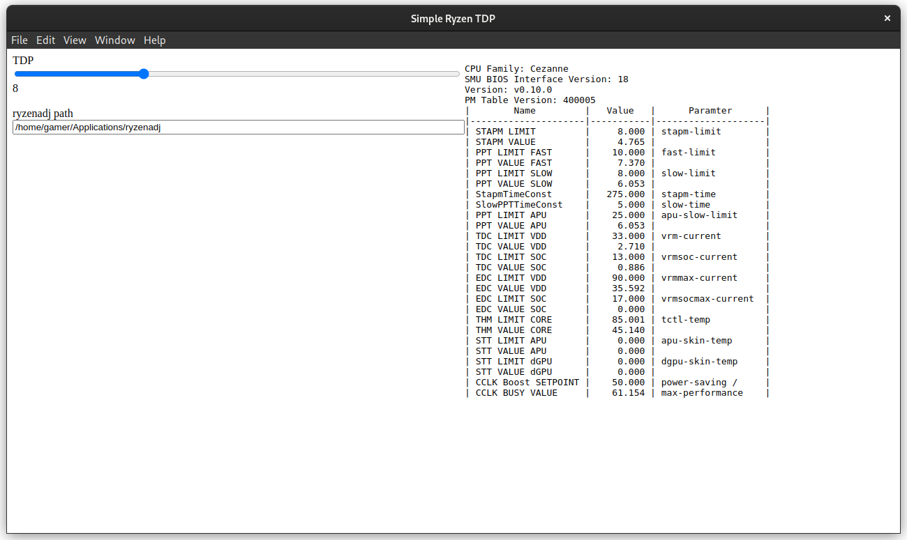

# Simple Ryzen TDP

This is a very simple Linux TDP app that wraps ryzenadj



# Configure and usage

compile AppImage via `npm run package`, which will create the appimage file in the `dist` directory.

compile a ryzenadj binary, see [ryzenadj readme](https://github.com/FlyGoat/RyzenAdj#installation)

in terminal/console, run the `configure.sh` for to enable sudo-less access to the ryzenadj binary

e.g.
```bash
./configure.sh path_to_ryzenadj_binary
# e.g.
./configure.sh /home/username/applications
```

then run the simple ryzen tdp appimage, and add the full filepath to ryzenadj binary in the appropriate text input.

The TDP slider should work after all configuration is complete

# Disclaimer

This software is provided "as is", I built this app solely for personal use only. In no event shall I be liable for any direct, indirect, incidental, special, or consequential damages. I have no intention of supporting this app beyond maintenance fixes, although PRs are welcome